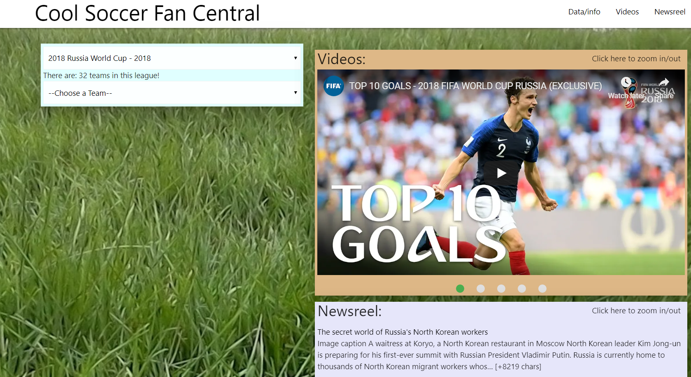

# Project-1
A Sporting Sporty Sports Sport Roster (Soccer Central):
https://iwijetunge.github.io/project1/  
An Application designed to help Soccer fans get information, both news and videos, about their favorite teams, leagues, and players. Simply select an option from the drop down menu and watch as the application gets you results.

Utilized Materialize, Google News API, Youtube API, API-Football, and Firebase  

User Interface by Laura Elias  
API-Football Connection by Ivan Wijetunge  
Youtube API Connection by Chris Cannaday  
Google News API Connection by Sabrina Thong  
Database Design by Kieran Anthony

Lead Developer - Ivan Wijetunge  
Project Manager - Kieran Anthony